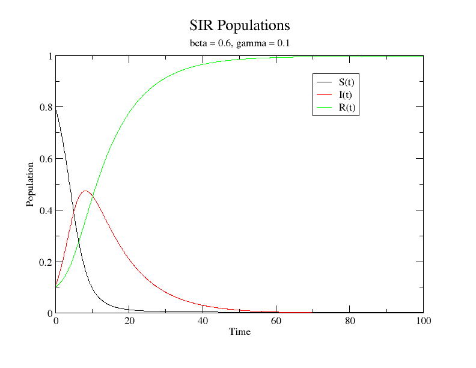

SIR
===

The SIR Model is a two-parameter [epidemiological model](https://en.wikipedia.org/wiki/Epidemic_model) that computes the theoretical number of people infected with a contagious illness in a closed population over time[(1)](http://mathworld.wolfram.com/SIRModel.html). This python script numerically solves the differential equations for a given parameter set and initial conditions.

S, I, and R represent the number of individuals that are suceptible to, infected with, and recovered from a disease, respectively.

Beta controls the infection rate. 
Gamma controls the immunity rate.

## Usage

	python3 sir.py beta gamma s0 i0 r0 dt timesteps

Example
-------

